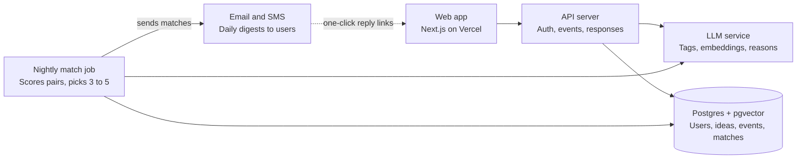

# HackaMatch — Platform Framework

Oct 8, 2026 · Terence

## Overview

HackaMatch pairs Cornell Tech students who have ideas with students who can build them, in under a minute of effort per person. Everyone joins one campus-wide pool, and hackathons are optional tags, so people can find a partner first and pick an event together.

**Problem.** Idea people don't know who can code, and coders don't know which ideas are worth their weekend. Team formation today happens in group chats and at the start of events, so many people show up teamless or skip the event.

**Users.**

- **Idea people:** MBA, design, policy and other non-engineering students with a product idea.
- **Builders:** engineering and CS students who want a team or an interesting project.
- **Both:** students who have an idea and can also build part of it.
- **Organizers:** hackathon hosts and clubs who want fewer teamless attendees.

**Core principle: least input, most return.** Ask for one sentence, infer everything else, and push matches to people instead of making them search. Every screen is judged by how few fields it asks for.

## Product pillars

Five pillars carry the least-input, most-return principle; every feature in the plan should map to one of them.

| Pillar | What it means | Key features |
| --- | --- | --- |
| Zero-friction onboarding | Sign up with one tap and one sentence | Cornell email magic link, role and intent picker, free-text idea or skills box, GitHub/LinkedIn import |
| Inferred profiles | The system fills in structure the user never types | LLM extraction of domain, skills, stack and scope; editable tags; embeddings for matching |
| One open pool | Partner first, event optional | Campus-wide pool, intent (hackathon partner / side project / co-founder), optional event tags, organizer event views |
| Pushed, mutual matches | People get matches instead of searching | Daily 3–5 picks with a one-line reason, Interested/Pass, contact revealed on mutual interest, no expiry, users stay in the pool after matching |
| Meet them where they are | The notification is the product | Email and SMS digests, one-click responses, low-commitment coffee-chat ask |

## Core user flows

Four flows cover the MVP; the first two should each take under 60 seconds.

**1. Onboarding (any user)**

1. Land on the public board and browse ideas and builders without an account.
2. Tap a CTA, enter a Cornell email, click the magic link.
3. Pick a role (I have an idea / I can build / Both) and an intent (hackathon partner / side project / co-founder).
4. Type one sentence, or paste a GitHub or LinkedIn URL.
5. See inferred tags, optionally tag hackathons of interest, and join the pool.

**2. Posting an idea**

1. Write the idea in one or two sentences.
2. The system extracts domain, needed skills, and rough scope.
3. The idea appears on the public board and enters the match pool.

**3. Daily match loop**

1. Each evening, every active user gets 3–5 matches by email or SMS, each with a one-line reason.
2. User taps Interested or Pass directly from the message.
3. On mutual Interested, both get each other's contact and a suggested 15-minute coffee-chat message.
4. The pair gets a shared page listing upcoming hackathons; each taps the ones they'd do and overlaps are highlighted. Matches never expire, and both people stay in the pool to keep matching for the same or other events.

**4. Organizer setup**

1. Organizer creates an event with name, dates, and team size limits.
2. Shares one link; pool members get a nudge two weeks before the event.
3. Sees an event view of the pool: who tagged the event, their matches, and who is still looking.

## Data model

Six entities cover the MVP; user-typed fields are kept to the raw sentence, and everything else is derived.

| Entity | Key fields | Notes |
| --- | --- | --- |
| User | id, cornell_email, name, role (idea / builder / both), intent[], event_interests[], raw_bio, github_url, linkedin_url, notify_channel | Only email and role are required; everyone is in the pool |
| Profile | user_id, skills[], stack[], domains[], experience_level, embedding | Derived by LLM from raw_bio and imports; user can edit tags |
| Idea | id, owner_id, event_id (optional), raw_text, domain, skills_needed[], scope, embedding, status (open / filled) | One user can own several ideas |
| Event | id, name, start_date, end_date, team_size_max, organizer_id | Optional; a lens on the pool, not a separate pool |
| Match | id, user_a, user_b, idea_id (optional), event_id (optional), score, reason, a_response, b_response, revealed_at | No expiry; a user can hold many matches at once |
| Team | id, event_id (optional), idea_id, member_ids[] | A user can be on several teams, for the same or different events |

## Matching engine

Start with a simple scored ranking across the campus pool, and add learning only once there is response data to learn from.

**Stage 1 — rules + embeddings (MVP)**

- **Hard filters:** compatible intent, complementary roles (idea ↔ builder), not already matched or passed. Being matched never removes anyone from the pool.
- **Score** each candidate pair as a weighted sum:
  - Skill coverage: share of the idea's skills_needed the builder has.
  - Semantic fit: cosine similarity between idea and builder embeddings, plus a boost for shared event tags.
  - Freshness: boost recently active users so matches get answered.
  - Fairness: penalize people who already got many matches today, so attention spreads.
- **Pick** the top 3–5 per user per day.
- **Reason line:** an LLM writes one sentence from the top-scoring factors, e.g. "Needs a React dev for a health app; you've built 2 React projects."

**Stage 2 — learned ranking (after ~500 responses)**

- Treat each Interested/Pass as a label and tune the weights, or train a small ranking model.
- Track which reasons lead to mutual interest and favor them.

**Cold start:** while the pool has fewer than ~20 people, skip the algorithm and send a curated digest of every open idea.

## System architecture and tech stack

A single Next.js app plus one scheduled job is enough for the MVP; there is no need for microservices at campus scale.

The web app and API handle signup and responses in real time; the match job runs once a night, writes matches to Postgres, and sends digests whose links call back into the app.

| Layer | Suggested choice | Why |
| --- | --- | --- |
| Frontend + API | Next.js (TypeScript) on Vercel | One codebase, free tier, fast to ship |
| Auth | Magic link restricted to @cornell.edu (Supabase Auth or NextAuth) | No passwords, verifies Cornell affiliation |
| Database | Supabase Postgres with pgvector | Relational data and embeddings in one place |
| LLM | Claude API | Tag extraction from one sentence, match reason lines |
| Embeddings | An embeddings API, stored in pgvector | Semantic idea-to-builder similarity |
| Scheduler | Vercel Cron or Supabase scheduled functions | Runs the nightly match job |
| Notifications | Resend (email), Twilio (SMS, later) | One-click Interested/Pass links |
| Imports | GitHub REST API; LinkedIn via pasted text | GitHub is public and easy; LinkedIn's API is restricted |

## Phased roadmap

Build in four phases, and move on only when the gate after each phase is met. Durations are estimates for one part-time builder.

| Phase | Duration | Scope | Gate to move on |
| --- | --- | --- | --- |
| 0. Validate | ~2 weeks | Form + curated email; one pilot hackathon; seed 15–20 ideas; match pairs by hand | 40+ signups, 5 teams |
| 1. MVP | ~4 weeks | Magic-link signup; one-sentence profiles; open pool + idea board; Interested / Pass | 10+ teams at the pilot |
| 2. Auto-matching | ~4 weeks | Nightly match job; embeddings + reasons; email digests; organizer dashboard | 15% mutual match rate |
| 3. Scale | Ongoing | Learned ranking; SMS and Slack; all of Cornell; semester project pools | — |

Phase 0 needs no code: a form and hand-picked matches test whether people want this before any engineering. Each phase is the natural unit to expand into its own implementation plan with tickets and dates.

## Metrics

The north-star metric is **teams formed per event**; the rest diagnose where the funnel leaks. Targets are starting guesses to revise after the first event.

| Metric | Definition | Starting target |
| --- | --- | --- |
| Teams formed | Pairs that mark "We teamed up" per event | 10+ at the pilot |
| Onboarding completion | Signups who finish role + sentence | 80% |
| Time to onboard | Median seconds from link click to joining the pool | Under 60 s |
| Response rate | Matches that get Interested or Pass within 24 h | 50% |
| Mutual match rate | Matches where both say Interested | 15% |
| Teamless attendees | Users who tagged the event with no mutual match at event start | Down vs. last year |

## Risks and open questions

The biggest risk is liquidity: a matching app with too few people on either side feels empty and loses users fast.

| Risk | Mitigation |
| --- | --- |
| Too few users in the pool | Launch tied to one hackathon; seed 15–20 ideas yourself; curated digest under 20 users |
| Imbalance (many idea people, few builders) | Recruit builders through CS courses and clubs; let builders see idea quality before signing up |
| Ideas are vague or low quality | LLM prompts the poster to add one missing detail; organizers can feature ideas |
| Notification fatigue | Cap at one digest per day, weekly when no tagged event is near; users can pause anytime |
| Privacy of contact info | Reveal only on mutual Interested; Cornell-only login |
| Idea theft concerns | Show a short public pitch; full detail only after a match |

**Open questions**

- [ ] Which hackathon is the pilot, and when is it?
- [ ] Open to all of Cornell (Ithaca too) or Cornell Tech only at first?
- [ ] Partner with organizers from day one, or launch independently?
- [ ] Email only, or also SMS and Slack for notifications?
- [ ] Should teams of 3–4 be matched directly, or only pairs that then grow?
- [ ] Should a partner see that you're already teamed up with someone else for the same event?
