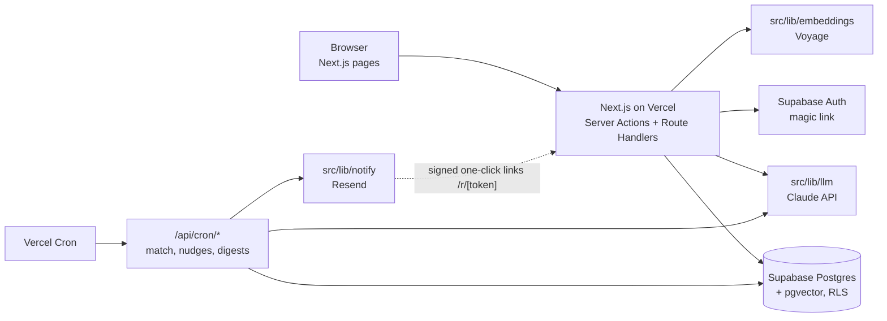
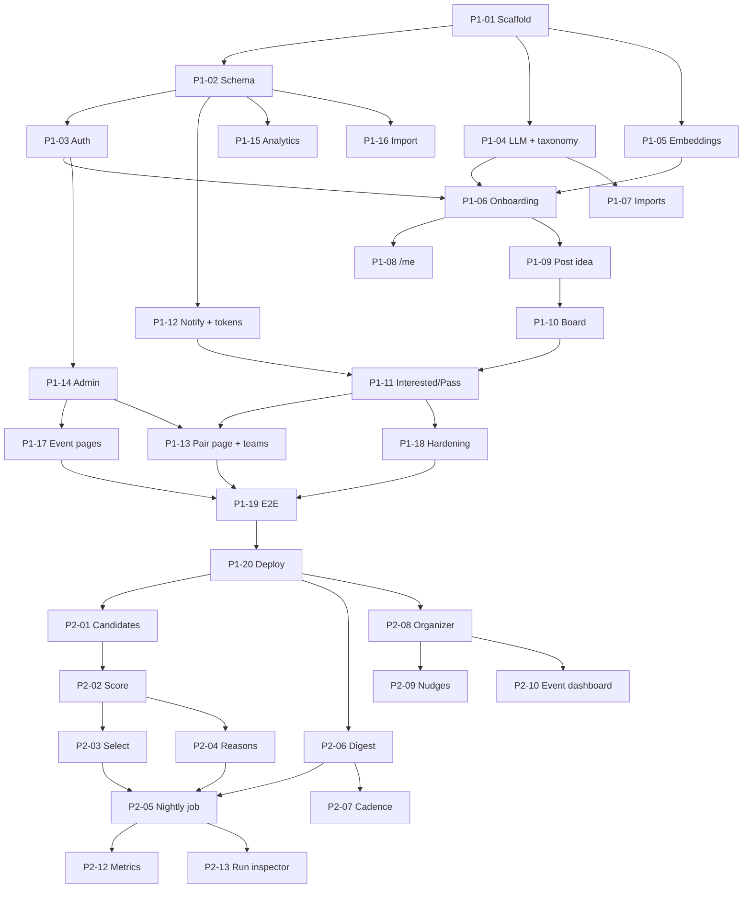

# HackaMatch — Implementation Plan

Source of truth for product intent: [`docs/FRAMEWORK.md`](./FRAMEWORK.md).
This document turns that framework into phased, ticket-sized work that any coding agent can pick up without extra context.

---

## 0. How to use this plan

### 0.1 Reading order for an agent picking up a ticket

1. Read §1 (decisions), §2 (architecture and repo layout), §3 (data model) once.
2. Find your ticket in §5–§8. Check its **Depends on** list; those tickets must be merged first.
3. Implement exactly the ticket's **Spec**. If something is ambiguous, prefer the option that asks the user for fewer fields (the core principle) and note the choice in the PR description.
4. Satisfy every **Acceptance criteria** bullet and the global Definition of Done (§0.3).

### 0.2 Ticket format

Every ticket has:

- **ID** — `P<phase>-<nn>`, e.g. `P1-06`.
- **Depends on** — ticket IDs that must land first.
- **Pillar** — which framework pillar it serves (Onboarding, Inferred profiles, Open pool, Pushed matches, Meet them where they are, Organizers, Platform).
- **Files** — the files to create or change (paths are relative to repo root).
- **Spec** — what to build.
- **Acceptance criteria** — checkable statements; a reviewer verifies each one.
- **Tests** — the tests the ticket must add.

### 0.3 Global Definition of Done (applies to every ticket)

- `pnpm typecheck`, `pnpm lint`, and `pnpm test` pass.
- New SQL lives in a new, numbered migration under `supabase/migrations/`; never edit a merged migration.
- Regenerate DB types (`pnpm db:types`) whenever the schema changes and commit the result.
- No secrets in code; every new env var is added to `.env.example` and §9.
- Every user-facing page works at 375 px width and has no field the ticket did not ask for.
- External services (Claude, embeddings, Resend, GitHub, Twilio) are called only through their wrapper in `src/lib/*`, and each wrapper has a `fake` implementation selected by env var so tests and local dev run with no API keys.
- PR description lists which acceptance criteria were verified and how.

---

## 1. Decisions and assumptions

The framework leaves some choices open. These are the defaults the plan uses; each one is isolated behind config so it can change without rework.

| Topic | Decision for this plan | Where it is configurable |
| --- | --- | --- |
| Pilot scope | Cornell Tech first, any `@cornell.edu` address may sign up | `ALLOWED_EMAIL_DOMAINS` env var; `users.campus` column |
| Organizers | Launch independently; admins create events in Phase 1, organizers self-serve in Phase 2 | `users.is_organizer` flag |
| Notification channels | Email only in Phases 1–2; SMS and Slack in Phase 3 | `users.notify_channel` |
| Team size | Match pairs only; pairs grow into teams via the "We teamed up" flow and adding members | — |
| Showing existing teams | A partner can see on the shared pair page that the other person is already on a team for the same event (a small "already teamed for X" badge). Revisit after the pilot | `SHOW_EXISTING_TEAMS` feature flag |
| Framework stack | Next.js 15 (App Router, TypeScript, React Server Components, Server Actions), Tailwind CSS, Supabase (Auth, Postgres, pgvector), deployed on Vercel | — |
| Package manager | pnpm | — |
| DB access | Supabase SQL migrations + `supabase-js` with generated types. No ORM | — |
| Validation | `zod` for every server-action and route-handler input, and every LLM output | — |
| LLM | Claude API via `@anthropic-ai/sdk`. Extraction uses `LLM_MODEL_FAST` (default `claude-haiku-5-5`); reason lines and coffee-chat drafts use the same model. Structured output via a forced tool call with a JSON schema | `LLM_MODEL_FAST`, `LLM_PROVIDER=anthropic|fake` |
| Embeddings | Voyage AI `voyage-4-lite` (about $0.02 per 1M tokens, reportedly with a 200M-token free allowance across the voyage-4 models; campus-scale use stays well inside it) behind an `Embedder` interface. Request 1024-dimension output explicitly; vectors stored in `vector(1024)` columns. Use the regular embeddings endpoint, not the Batch API, because free tokens reportedly don't apply to batch jobs | `EMBEDDINGS_PROVIDER=voyage|fake`, `EMBEDDING_MODEL`, `EMBEDDING_DIM` |
| Email | Resend + React Email templates | `EMAIL_PROVIDER=resend|fake` |
| Scheduler | Vercel Cron calling protected route handlers | `CRON_SECRET` |
| Time zone | All "daily" logic uses `America/New_York` | `APP_TIMEZONE` |
| Public identity | Logged-out board shows ideas as a short public pitch, and people as first name + last initial + tags. No email, no full idea text, no links | — |
| Idea privacy | Full `raw_text` is visible only to the owner and to users with a mutual match on that idea | RLS policies |
| Testing | Vitest (unit), Playwright (e2e) against local Supabase (`supabase start`) | — |

---

## 2. Architecture and repository layout

### 2.1 Runtime architecture



Rules:

- **Request path** (user clicks): Server Components read via the user-scoped Supabase client (RLS applies). Mutations are Server Actions that validate with zod, check auth, then write.
- **Privileged path** (cron jobs, one-click token links, admin pages): use the service-role client from `src/lib/supabase/service.ts`. Only files under `src/app/api/cron/**`, `src/app/r/**`, `src/app/admin/**`, `src/server/**` may import it (enforced with an ESLint `no-restricted-imports` rule).
- **Slow work** (LLM extraction, embeddings) runs after the response via Next.js `after()` when it must not block the user; onboarding waits up to 8 s for tags, then falls back to background processing (see `P1-06`).

### 2.2 Repository layout

```
.
├── docs/                         FRAMEWORK.md, IMPLEMENTATION_PLAN.md, runbooks
├── supabase/
│   ├── config.toml
│   ├── migrations/               0001_init.sql, 0002_..., numbered, append-only
│   └── seed.sql                  local dev seed (fake users, ideas, events)
├── scripts/
│   ├── import-phase0.ts          CSV → users/ideas/matches (P1-16)
│   ├── seed-dev.ts               richer generated seed using fake LLM
│   └── fit-weights.ts            Phase 3 ranking fit (P3-02)
├── src/
│   ├── app/
│   │   ├── page.tsx              public board (ideas + builders)
│   │   ├── login/page.tsx
│   │   ├── auth/callback/route.ts
│   │   ├── onboarding/page.tsx   single page, multi-step client component
│   │   ├── ideas/new/page.tsx
│   │   ├── ideas/[id]/page.tsx
│   │   ├── people/[id]/page.tsx
│   │   ├── me/page.tsx           profile + tag editing + settings
│   │   ├── matches/page.tsx
│   │   ├── matches/[id]/page.tsx shared pair page
│   │   ├── r/[token]/page.tsx    one-click Interested/Pass landing
│   │   ├── e/[slug]/page.tsx     public event share link
│   │   ├── organizer/…           Phase 2
│   │   ├── admin/…               admin tools
│   │   └── api/cron/{match,nudges,weekly}/route.ts
│   ├── components/               UI components (cards, tag editor, buttons)
│   ├── lib/
│   │   ├── supabase/{server,browser,service,middleware}.ts
│   │   ├── auth.ts               requireUser(), requireAdmin(), requireOrganizer()
│   │   ├── llm/{client,fake,prompts,extract-profile,extract-idea,reason,coffee-chat}.ts
│   │   ├── embeddings/{index,voyage,fake}.ts
│   │   ├── taxonomy/{skills.ts,normalize.ts}
│   │   ├── imports/{github,linkedin}.ts
│   │   ├── matching/{types,candidates,filters,score,select,run,cold-start}.ts
│   │   ├── notify/{index,resend,fake,tokens,cadence}.ts
│   │   ├── notify/templates/*.tsx
│   │   ├── analytics.ts
│   │   ├── config.ts             typed env access (zod-parsed)
│   │   └── time.ts               timezone helpers
│   ├── server/                   server-only domain services (profiles, ideas, matches, events)
│   └── types/db.ts               generated by `supabase gen types`
├── tests/
│   ├── unit/
│   └── e2e/
├── src/middleware.ts             Supabase session refresh + route guards (lives in src/ because the app uses a src directory)
├── vercel.json                   cron schedule
└── .env.example
```

---

## 3. Data model

The framework's six entities (User, Profile, Idea, Event, Match, Team) are kept. Supporting tables are added for things the framework implies but does not list: event interests (join table instead of an array, for querying), per-pair event votes (the shared pair page), team members (join table instead of an array), notification log (cadence caps), match runs (job idempotency), and analytics events (metrics).

The initial migration `supabase/migrations/0001_init.sql` must create the following. Column names are normative; agents may add indexes but not rename columns.

```sql
create extension if not exists vector;
create extension if not exists citext;

create type user_role        as enum ('idea', 'builder', 'both');
create type user_intent      as enum ('hackathon', 'side_project', 'cofounder');
create type notify_channel   as enum ('email', 'sms', 'slack', 'none');
create type experience_level as enum ('beginner', 'intermediate', 'advanced');
create type idea_scope       as enum ('weekend', 'few_weeks', 'ongoing');
create type idea_status      as enum ('open', 'filled', 'archived');
create type match_response   as enum ('pending', 'interested', 'pass');
create type match_source     as enum ('admin', 'board', 'nightly', 'curated');

-- One row per auth user. Only cornell_email is required at creation; role is
-- required to finish onboarding.
create table users (
  id               uuid primary key references auth.users(id) on delete cascade,
  cornell_email    citext not null unique,
  name             text,                         -- display name; first name is enough
  campus           text not null default 'cornell_tech',
  role             user_role,                    -- null until onboarding step 3
  intents          user_intent[] not null default '{}',
  raw_bio          text,                         -- the one sentence, verbatim
  github_url       text,
  linkedin_url     text,
  linkedin_text    text,                         -- pasted About/Experience text
  notify_channel   notify_channel not null default 'email',
  phone_e164       text,                         -- Phase 3 (SMS)
  is_admin         boolean not null default false,
  is_organizer     boolean not null default false,
  paused_until     timestamptz,                  -- null = active
  onboarding_started_at timestamptz,
  onboarded_at     timestamptz,                  -- set when the user joins the pool
  last_active_at   timestamptz not null default now(),
  created_at       timestamptz not null default now(),
  updated_at       timestamptz not null default now()
);

-- Derived by LLM; user may edit tags (user_edited = true stops overwrites).
create table profiles (
  user_id          uuid primary key references users(id) on delete cascade,
  summary          text,                         -- public one-liner, LLM-written
  skills           text[] not null default '{}', -- canonical taxonomy slugs
  stack            text[] not null default '{}',
  domains          text[] not null default '{}',
  experience_level experience_level,
  embedding        vector(1024),
  user_edited      boolean not null default false,
  extraction_model text,
  extracted_at     timestamptz,
  embedded_at      timestamptz
);

create table events (
  id               uuid primary key default gen_random_uuid(),
  slug             text not null unique,
  name             text not null,
  description      text,
  url              text,
  start_date       date not null,
  end_date         date not null,
  team_size_min    int  not null default 2,
  team_size_max    int  not null default 4,
  organizer_id     uuid references users(id),
  nudge_sent_at    timestamptz,
  created_at       timestamptz not null default now(),
  check (end_date >= start_date),
  check (team_size_max >= team_size_min)
);

create table event_interests (
  user_id   uuid references users(id) on delete cascade,
  event_id  uuid references events(id) on delete cascade,
  created_at timestamptz not null default now(),
  primary key (user_id, event_id)
);

create table ideas (
  id                 uuid primary key default gen_random_uuid(),
  owner_id           uuid not null references users(id) on delete cascade,
  event_id           uuid references events(id) on delete set null,
  raw_text           text not null,              -- private: owner + mutual matches
  pitch              text,                       -- public short pitch, LLM-written
  domain             text,
  skills_needed      text[] not null default '{}',
  scope              idea_scope,
  clarifying_question text,                      -- LLM's "one missing detail" prompt
  embedding          vector(1024),
  status             idea_status not null default 'open',
  featured           boolean not null default false,
  created_at         timestamptz not null default now(),
  updated_at         timestamptz not null default now()
);

create table match_runs (
  id          uuid primary key default gen_random_uuid(),
  run_date    date not null unique,              -- local date in APP_TIMEZONE
  mode        text not null,                     -- 'algorithm' | 'cold_start'
  status      text not null default 'running',   -- running|scored|reasoned|sent|failed
  weights     jsonb not null,
  stats       jsonb not null default '{}',
  error       text,
  started_at  timestamptz not null default now(),
  finished_at timestamptz
);

-- One row per unordered pair, ever. user_a < user_b canonically.
create table matches (
  id              uuid primary key default gen_random_uuid(),
  user_a          uuid not null references users(id) on delete cascade,
  user_b          uuid not null references users(id) on delete cascade,
  idea_id         uuid references ideas(id) on delete set null,
  event_id        uuid references events(id) on delete set null,
  source          match_source not null,
  run_id          uuid references match_runs(id),
  score           real,
  score_breakdown jsonb,                         -- feature values + weights used
  reason_for_a    text,                          -- one line shown to user_a
  reason_for_b    text,
  a_response      match_response not null default 'pending',
  b_response      match_response not null default 'pending',
  a_responded_at  timestamptz,
  b_responded_at  timestamptz,
  revealed_at     timestamptz,                   -- set when both interested
  teamed_up_at    timestamptz,
  created_at      timestamptz not null default now(),
  check (user_a < user_b),
  unique (user_a, user_b)
);

create table match_event_votes (
  match_id  uuid references matches(id) on delete cascade,
  user_id   uuid references users(id) on delete cascade,
  event_id  uuid references events(id) on delete cascade,
  created_at timestamptz not null default now(),
  primary key (match_id, user_id, event_id)
);

create table teams (
  id          uuid primary key default gen_random_uuid(),
  event_id    uuid references events(id) on delete set null,
  idea_id     uuid references ideas(id) on delete set null,
  match_id    uuid references matches(id) on delete set null, -- the match that formed it
  created_by  uuid not null references users(id),
  created_at  timestamptz not null default now()
);

create table team_members (
  team_id   uuid references teams(id) on delete cascade,
  user_id   uuid references users(id) on delete cascade,
  joined_at timestamptz not null default now(),
  primary key (team_id, user_id)
);

create table notification_log (
  id           uuid primary key default gen_random_uuid(),
  user_id      uuid not null references users(id) on delete cascade,
  channel      notify_channel not null,
  kind         text not null,  -- digest|curated_digest|inbound_interest|mutual|event_nudge|weekly
  local_date   date not null,  -- date in APP_TIMEZONE, for "one digest per day"
  payload      jsonb not null default '{}',
  provider_id  text,
  status       text not null default 'sent',     -- sent|failed|skipped
  created_at   timestamptz not null default now()
);
create unique index notification_one_digest_per_day
  on notification_log (user_id, local_date)
  where kind in ('digest', 'curated_digest', 'weekly');

create table analytics_events (
  id         bigserial primary key,
  user_id    uuid references users(id) on delete set null,
  name       text not null,
  props      jsonb not null default '{}',
  created_at timestamptz not null default now()
);

-- Indexes
create index on ideas (owner_id);
create index on ideas (status);
create index on matches (user_a);
create index on matches (user_b);
create index on matches (run_id);
create index on event_interests (event_id);
create index on analytics_events (name, created_at);
create index profiles_embedding_hnsw on profiles using hnsw (embedding vector_cosine_ops);
create index ideas_embedding_hnsw    on ideas    using hnsw (embedding vector_cosine_ops);
```

Also in `0001_init.sql`:

- **Email-domain guard:** a `before insert` trigger on `users` that raises unless `split_part(cornell_email, '@', 2)` is in the allowed list. Read the list from a one-row `app_settings(allowed_email_domains text[])` table seeded with `{'cornell.edu'}` so it can change without a deploy.
- **Auto-provision:** an `after insert on auth.users` trigger (security definer) that inserts the matching `users` row and an empty `profiles` row.
- **`updated_at` trigger** on `users` and `ideas`.
- **Helper view** `active_pool` = users where `onboarded_at is not null and (paused_until is null or paused_until < now())`.

### 3.1 Row-level security

Enable RLS on every table. Policies (the user-scoped client uses these; the service client bypasses them):

| Table | Select | Insert/Update/Delete |
| --- | --- | --- |
| users | own row; admins all | update own row (not `is_admin`, `is_organizer`, `cornell_email` — enforce with a column-level `grant update (...)`) |
| profiles | own row | update own row |
| ideas | own rows; rows where a revealed match references the idea | insert/update/delete own rows |
| events | everyone (incl. anon) | organizer of the event, admins |
| event_interests | own rows; organizer of the event | own rows |
| matches | rows where `auth.uid()` in (`user_a`, `user_b`) | none (all writes go through server code with the service client) |
| match_event_votes | rows for matches you are in | own rows for matches you are in |
| teams, team_members | teams you are in | through server code |
| notification_log, match_runs, analytics_events | admins only | server code only |

Public board data is served through two `security definer` SQL functions that return only safe columns, callable by `anon`:

- `public_board_ideas(limit, offset, event_slug default null)` → `id, pitch, domain, skills_needed, scope, event_id, featured, created_at, owner_display` (first name + last initial).
- `public_board_people(limit, offset, role_filter default null)` → `user_id, display_name, role, summary, skills, stack, domains, experience_level`.

Both return only onboarded, non-paused users and open ideas.

### 3.2 Canonical skill taxonomy

Skill coverage can only be computed if idea skills and builder skills use the same vocabulary. `src/lib/taxonomy/skills.ts` exports ~150 canonical slugs grouped as `skills` (e.g. `frontend`, `backend`, `ml`, `data-analysis`, `ux-design`, `product-management`, `hardware`), `stack` (e.g. `react`, `nextjs`, `python`, `pytorch`, `swift`, `figma`), and `domains` (e.g. `health`, `fintech`, `climate`, `edtech`, `civic`, `devtools`), each with an alias list. `normalize.ts` maps free text to slugs (lowercase, strip punctuation, alias lookup, drop unknowns). Every LLM output and every user tag edit passes through `normalize`.

---

## 4. Phase overview

| Phase | Goal | Tickets | Exit gate (from framework) |
| --- | --- | --- | --- |
| 0. Validate | Prove demand with no code | P0-01 … P0-05 | 40+ signups, 5 teams |
| 1. MVP | Self-serve signup, inferred profiles, open pool, board, Interested/Pass, contact reveal | P1-01 … P1-20 | 10+ teams at the pilot |
| 2. Auto-matching | Nightly matching with reasons, email digests, organizer tools | P2-01 … P2-14 | 15% mutual match rate |
| 3. Scale | Learned ranking, SMS/Slack, all of Cornell, semester pools | P3-01 … P3-08 | — |

Parallelization inside each phase is shown in §10.

---

## 5. Phase 0 — Validate (no code, ~2 weeks)

Phase 0 is run by a human. Coding agents only need its outputs, which feed `P1-16` (import). Keep the data shapes below so nothing is retyped later.

### P0-01 Sign-up form
- **Pillar:** Onboarding
- **Spec:** A Google Form with exactly these fields: Cornell email (validated to end in `@cornell.edu`), first name, role (`I have an idea` / `I can build` / `Both`), intent (checkboxes: `hackathon partner`, `side project`, `co-founder`), one sentence ("Your idea, or what you can build"), optional GitHub URL, optional LinkedIn URL, hackathons of interest (checkboxes listing upcoming events).
- **Output:** responses exported as CSV with header `email,name,role,intents,sentence,github_url,linkedin_url,events,submitted_at`. `intents` and `events` are `;`-separated. Save it as `data/phase0/signups.csv` (gitignored).

### P0-02 Seed ideas
- **Spec:** The founder writes 15–20 ideas. Don't create fake sign-up rows for them; put them in a separate file `data/phase0/seed_ideas.csv` with header `owner_email,sentence,event`, where `owner_email` is the founder's own Cornell address. P1-16 imports them as featured ideas owned by the admin account.

### P0-03 Manual matching playbook
- **Spec:** A Google Sheet `matches` with header `email_a,email_b,idea_sentence,reason,a_response,b_response,teamed_up,event`. Every evening, the operator picks 3–5 pairs per active person, writes a one-line reason, and sends the curated email (P0-04). Responses are recorded as `interested|pass|pending`.

### P0-04 Curated email template
- **Spec:** A plain-text template in `docs/runbooks/phase0-email.md`: greeting, up to five entries of `{name} — {sentence} — why: {reason}`, and "Reply 1 for interested, 2 for pass, per entry". When both reply 1, the operator sends both an intro email with a suggested coffee-chat line.

### P0-05 Gate check
- **Spec:** Count signups and `teamed_up = yes` rows. Gate: ≥40 signups and ≥5 teams. Record results in `docs/runbooks/phase0-results.md`, including what people said about vague ideas and builder/idea balance; Phase 1 prompts should use those findings.

---

## 6. Phase 1 — MVP (~4 weeks)

Outcome: a student can sign up in under 60 s, appear on the board with inferred tags, post ideas, mark Interested/Pass on people and ideas, and get contact details on mutual interest. Admins can create events and hand-make matches (so Phase 0's manual loop continues inside the product until Phase 2 automates it).

### P1-01 Project scaffold
- **Depends on:** —
- **Pillar:** Platform
- **Files:** `package.json`, `.npmrc`, `tsconfig.json`, `next.config.ts`, `postcss.config.mjs` (Tailwind 4 is configured in CSS, so there is no `tailwind.config.ts`), `eslint.config.mjs`, `.prettierrc`, `vitest.config.ts`, `playwright.config.ts`, `.env.example`, `.gitignore`, `src/app/layout.tsx`, `src/app/globals.css`, `src/app/page.tsx` (placeholder), `src/instrumentation.ts` (validates config at boot), `src/lib/config.ts`, `README.md`, `.github/workflows/ci.yml`.
- **Spec:**
  - Next.js 15 App Router with TypeScript `strict: true`, Tailwind, ESLint (next + `no-restricted-imports` for the service client, see §2.1), Prettier.
  - Scripts: `dev`, `build`, `start`, `lint`, `typecheck` (`tsc --noEmit`), `test` (vitest run), `test:e2e` (playwright), `db:start` (`supabase start`), `db:reset` (`supabase db reset`), `db:types` (`supabase gen types typescript --local > src/types/db.ts`).
  - `src/lib/config.ts` parses `process.env` with zod into a typed `config` object; it throws at boot on missing required vars. Provider switches (`LLM_PROVIDER`, `EMBEDDINGS_PROVIDER`, `EMAIL_PROVIDER`) default to `fake` when `NODE_ENV !== 'production'`.
  - CI: on push/PR run install, lint, typecheck, unit tests. E2E runs in a separate job that starts Supabase via `supabase/setup-cli` and `supabase start`.
  - `README.md`: setup steps (install pnpm, Supabase CLI, Docker; `pnpm db:start && pnpm db:reset && pnpm dev`).
- **Acceptance criteria:**
  - `pnpm dev` serves a page at `/`; `pnpm build` succeeds.
  - CI is green on the scaffold commit.
  - Importing `src/lib/supabase/service.ts` from a file under `src/components/` fails lint.
- **Tests:** a trivial unit test for `config.ts` (missing required var throws).

### P1-02 Database schema and Supabase setup
- **Depends on:** P1-01
- **Pillar:** Platform
- **Files:** `supabase/config.toml`, `supabase/migrations/0001_init.sql`, `supabase/migrations/0002_rls.sql`, `supabase/migrations/0003_public_board_fns.sql`, `supabase/seed.sql`, `src/types/db.ts`, `src/lib/supabase/{server,browser,service,middleware}.ts`, `src/middleware.ts`.
- **Spec:**
  - Implement §3 exactly (tables, enums, triggers, `app_settings`, `active_pool`, RLS, public board functions).
  - `seed.sql`: 3 events (one 3 weeks out, one 8 weeks out, one past), 12 users across roles with profiles filled using deterministic fake embeddings (`[0.0, …]` is not acceptable — use the fake embedder's output generated once and pasted, or have `scripts/seed-dev.ts` fill embeddings after `db reset`), 6 ideas, 1 admin (`admin@cornell.edu`).
  - Supabase clients per `@supabase/ssr` conventions: `server.ts` (cookies, user-scoped), `browser.ts`, `service.ts` (service role, `import 'server-only'`), `middleware.ts` (session refresh).
  - `config.toml`: enable email OTP/magic link, set site URL and redirect URLs for local dev; local Inbucket/Mailpit enabled for capturing magic links.
- **Acceptance criteria:**
  - `pnpm db:reset` applies all migrations and seed with no errors.
  - Inserting an auth user with `x@gmail.com` fails; with `x@cornell.edu` creates `users` + `profiles` rows.
  - As `anon`, selecting from `users` returns 0 rows, while `public_board_ideas(20, 0)` returns seeded open ideas without `raw_text`.
  - As user A, selecting `matches` returns only matches containing A.
- **Tests:** SQL-level tests in `tests/db/*.test.ts` (Vitest + local Supabase) covering each acceptance bullet.

### P1-03 Magic-link auth restricted to Cornell
- **Depends on:** P1-02
- **Pillar:** Onboarding
- **Files:** `src/app/login/page.tsx`, `src/app/login/actions.ts`, `src/app/auth/callback/route.ts`, `src/lib/auth.ts`, `src/app/logout/route.ts`.
- **Spec:**
  - `/login`: one email input + submit. Server action validates with zod: email format and domain in `app_settings.allowed_email_domains` (friendly error "Use your @cornell.edu email"). Calls `supabase.auth.signInWithOtp({ email, options: { emailRedirectTo: `${APP_URL}/auth/callback?next=…` } })`. Shows "Check your inbox" state.
  - Accept `?next=` (relative paths only) so a CTA on an idea card returns the user there after login.
  - `/auth/callback`: exchanges the code, records `analytics_events('magic_link_clicked')`, sets `users.onboarding_started_at` if null, then redirects to `/onboarding` if `onboarded_at is null`, else to `next` or `/matches`.
  - `src/lib/auth.ts`: `getUser()`, `requireUser()` (redirects to `/login?next=…`), `requireOnboarded()`, `requireAdmin()`, `requireOrganizer()`.
  - Middleware: refresh session; protect `/me`, `/matches/**`, `/ideas/new`, `/organizer/**`, `/admin/**`.
  - Every authenticated request updates `users.last_active_at` at most once per hour (compare before writing).
- **Acceptance criteria:**
  - Non-Cornell email is rejected before any email is sent.
  - Clicking the magic link (captured from local Inbucket in e2e) lands a new user on `/onboarding`, and a returning onboarded user on `/matches`.
  - `?next=https://evil.com` is ignored.
- **Tests:** unit test for `next` sanitization and domain check; e2e login flow.

### P1-04 LLM wrapper, prompts, and taxonomy
- **Depends on:** P1-01
- **Pillar:** Inferred profiles
- **Files:** `src/lib/llm/{client.ts,fake.ts,prompts.ts,extract-profile.ts,extract-idea.ts}`, `src/lib/taxonomy/{skills.ts,normalize.ts}`.
- **Spec:**
  - `client.ts` exports `llm.structured<T>({ system, user, schema: z.ZodType<T>, toolName, maxTokens, timeoutMs })`. The Anthropic implementation sends a single tool whose `input_schema` is the JSON schema of `schema` (use `zod-to-json-schema`), forces `tool_choice: { type: 'tool', name }`, parses the tool input with zod, retries once on validation failure with the error appended, and throws `LlmError` after that. `fake.ts` implements the same interface with keyword rules over the taxonomy aliases (deterministic, no network).
  - `extractProfile({ role, sentence, githubSummary?, linkedinText? })` → `{ summary, skills[], stack[], domains[], experience_level, idea: { pitch, domain, skills_needed[], scope, clarifying_question|null } | null }`. `idea` is non-null only when the role is `idea` or `both` and the sentence describes a product.
  - `extractIdea({ text })` → `{ pitch, domain, skills_needed[], scope, clarifying_question|null }`.
  - Prompt rules (put them in `prompts.ts`, versioned with a `PROMPT_VERSION` constant):
    - Output tags only from the provided taxonomy list (include the slug list in the system prompt); never invent.
    - `summary` ≤ 15 words, third person, no names. `pitch` ≤ 20 words, describes the problem and user, omits any secret sauce detail.
    - `clarifying_question` is set only when a key detail is missing (target user, problem, or what's being built); it asks for exactly one thing in ≤ 15 words.
    - `experience_level`: infer from evidence (years, shipped projects, repos); default `intermediate` when unclear.
  - All outputs pass through `normalize()`; unknown slugs are dropped.
- **Acceptance criteria:**
  - With `LLM_PROVIDER=fake`, `extractProfile({ role: 'builder', sentence: 'I build React and Python apps, mostly health stuff' })` returns `stack` ⊇ `['react','python']` and `domains` ⊇ `['health']`.
  - With the Anthropic provider and a malformed first response, the wrapper retries once and then throws `LlmError`.
- **Tests:** unit tests for `normalize`, the fake provider, and the retry path (mock the SDK).

### P1-05 Embeddings wrapper
- **Depends on:** P1-01
- **Pillar:** Inferred profiles
- **Files:** `src/lib/embeddings/{index.ts,voyage.ts,fake.ts}`, `src/server/embed.ts`.
- **Spec:**
  - `embed(texts: string[], kind: 'document'|'query'): Promise<number[][]>`; Voyage implementation calls the embeddings endpoint with `model: EMBEDDING_MODEL` (default `voyage-4-lite`), `input_type` set from `kind`, and `output_dimension: EMBEDDING_DIM` (default 1024), batching up to 64 texts per request and asserting every returned vector has length `EMBEDDING_DIM`; fake implementation produces a deterministic unit vector of `EMBEDDING_DIM` from a seeded hash of tokens, so similar texts share dimensions (bag-of-words hashing).
  - `src/server/embed.ts`: `profileEmbeddingText(user, profile)` = `"Role: … Intents: … Skills: … Stack: … Domains: … About: <raw_bio> <github summary>"`; `ideaEmbeddingText(idea)` = `"Idea: <raw_text> Domain: … Needs: …"`. `embedProfile(userId)` and `embedIdea(ideaId)` read, embed, and write the vector plus `embedded_at`.
- **Acceptance criteria:** fake vectors for "react health app" and "health app built in react" have cosine > 0.7; for "react health app" vs "hardware climate sensor" < 0.3.
- **Tests:** unit tests for the fake embedder properties and text builders.

### P1-06 Onboarding flow (≤ 60 s)
- **Depends on:** P1-03, P1-04, P1-05
- **Pillar:** Onboarding, Inferred profiles
- **Files:** `src/app/onboarding/page.tsx`, `src/app/onboarding/OnboardingFlow.tsx` (client), `src/app/onboarding/actions.ts`, `src/server/profiles.ts`, `src/components/TagEditor.tsx`, `src/components/EventPicker.tsx`.
- **Spec:** One page, three short steps, no page reloads, progress dots.
  1. **Who are you?** Two tap groups: role (`I have an idea` / `I can build` / `Both`, single select) and intent (`Hackathon partner` / `Side project` / `Co-founder`, multi-select, default `Hackathon partner`). One optional text field "First name" (prefilled from GitHub import if present).
  2. **One sentence.** A single textarea whose placeholder depends on role (idea: "A mobile app that helps nurses swap shifts"; builder: "I build iOS apps in Swift and like health projects"; both: "I want to build X and I can do the backend"). Below it, a collapsed "or import" row with a GitHub URL field and a "paste LinkedIn About" textarea (P1-07). Submit calls `submitSentence`.
  3. **Here's what we got.** Shows inferred `summary` and tag chips (skills, stack, domains) in `TagEditor` (tap × to remove, type to add with autocomplete from the taxonomy). If an idea was extracted, shows its pitch and the `clarifying_question` (if any) as an optional one-line input. `EventPicker` lists upcoming events as toggle chips (optional). Button: "Join the pool".
  - `submitSentence` server action: saves `raw_bio` (and `name`, `role`, `intents`), calls `extractProfile` with an 8 s timeout. On success, writes profile tags and, if `idea` is non-null, inserts an `ideas` row. On timeout/error, returns `{ pending: true }`; the UI shows "We'll fill in your tags in a moment" and the work continues in `after()`.
  - `joinPool` server action: saves edited tags (sets `profiles.user_edited = true` if the user changed anything), appends the clarifying answer to `ideas.raw_text` and re-runs `extractIdea` in `after()`, upserts `event_interests`, sets `onboarded_at = now()`, triggers `embedProfile` and `embedIdea` in `after()`, logs `analytics_events('pool_joined', { seconds_since_link_click })`, redirects to `/matches` with a welcome banner.
  - Log `onboarding_step_completed` with `{ step }` for each step.
- **Acceptance criteria:**
  - A builder can go from callback to pool with exactly: 2 taps, 1 sentence, 1 click (name and imports optional).
  - With the fake LLM, step 3 renders within 1 s of submitting step 2.
  - When the LLM throws, the user still joins the pool and tags appear later on `/me`.
  - An `idea`-role user who completes onboarding has one `ideas` row with `pitch` and `skills_needed`.
- **Tests:** e2e "builder onboarding" and "idea onboarding" (fake LLM); unit test for `joinPool` input schema.

### P1-07 GitHub and LinkedIn import
- **Depends on:** P1-04
- **Pillar:** Onboarding, Inferred profiles
- **Files:** `src/lib/imports/github.ts`, `src/lib/imports/linkedin.ts`, `src/app/onboarding/actions.ts` (extend).
- **Spec:**
  - `fetchGithubSummary(url)`: parse the username from `github.com/<user>` (reject anything else). Call `GET /users/{u}` and `GET /users/{u}/repos?sort=updated&per_page=30` (send `GITHUB_TOKEN` if set; 5 s timeout). Return `{ name, bio, summaryText }` where `summaryText` lists the top 8 languages by repo count, top topics, and the 5 most recent non-fork repo names + descriptions, capped at 1,500 chars. On failure return `null` and never block onboarding.
  - LinkedIn: store `linkedin_url` as given (validate `linkedin.com/in/…`); never fetch it. `linkedin_text` (pasted, capped at 3,000 chars) is passed to `extractProfile`.
  - If a user only provides a GitHub URL and no sentence, step 2 is still satisfiable: `raw_bio` becomes the GitHub bio or `"(imported from GitHub)"`.
- **Acceptance criteria:** pasting a valid GitHub URL with an empty sentence produces non-empty `stack` tags (verified with a recorded fixture of the GitHub responses).
- **Tests:** unit tests with fixture JSON for URL parsing, summary building, and failure → `null`.

### P1-08 Profile page and settings (`/me`)
- **Depends on:** P1-06
- **Pillar:** Inferred profiles, Meet them where they are
- **Files:** `src/app/me/page.tsx`, `src/app/me/actions.ts`.
- **Spec:** Sections: (1) the sentence (editable; saving re-runs extraction unless `user_edited`, and re-embeds); (2) tags via `TagEditor`; (3) role and intents; (4) events of interest; (5) my ideas list with status toggle `open`/`filled`/`archived`; (6) notifications: channel (email only for now), "Pause matches" for 1 week / 1 month / until I turn it back on (sets `paused_until`; "until" = year 9999); (7) "Delete my account" (confirms, deletes `auth.users` row via service client, cascades).
- **Acceptance criteria:** editing tags sets `user_edited = true` and a later sentence edit does not overwrite them; pausing removes the user from `public_board_people` and from `active_pool`; deleting removes all of the user's rows.
- **Tests:** e2e for tag edit persistence and pause.

### P1-09 Post an idea
- **Depends on:** P1-06
- **Pillar:** Open pool
- **Files:** `src/app/ideas/new/page.tsx`, `src/app/ideas/new/actions.ts`, `src/app/ideas/[id]/page.tsx`, `src/server/ideas.ts`.
- **Spec:**
  - `/ideas/new`: one textarea ("Your idea in one or two sentences"), optional event select. Submit → `extractIdea` (8 s timeout, fallback to background) → preview card showing pitch, domain, skills needed, scope, plus the clarifying question as an optional one-line input → "Post". Posting inserts the idea, triggers `embedIdea` in `after()`, redirects to `/ideas/[id]`.
  - Any onboarded user may post (a builder posting an idea is allowed; the framework allows one user to own several ideas). If a `builder`-role user posts an idea, set their role to `both`.
  - `/ideas/[id]`: owner sees full text, tags (editable), status controls. Other logged-in users see the pitch, tags, owner display name, and Interested/Pass (P1-11). Logged-out users see the pitch and a "Sign in to connect" CTA with `next` back to this page.
- **Acceptance criteria:** a posted idea appears in `public_board_ideas` within the same request (embedding may lag); non-owners never receive `raw_text` in the HTML/RSC payload until a mutual match exists.
- **Tests:** unit test that the non-owner query selects no `raw_text`; e2e post flow.

### P1-10 Public board (`/`)
- **Depends on:** P1-02, P1-09
- **Pillar:** Open pool, Onboarding
- **Files:** `src/app/page.tsx`, `src/components/{IdeaCard,PersonCard,BoardFilters}.tsx`.
- **Spec:**
  - Two tabs: **Ideas** and **Builders** (Builders includes `both`). Cards show the public fields from the §3.1 functions. Filters (URL query params, server-rendered): event, domain, skill, intent. Featured ideas first, then newest. Paginate 20 per page with "Load more".
  - Logged-out: hero line ("Find someone to build your idea with — or an idea worth your weekend"), CTA "Join with your Cornell email" → `/login?next=/onboarding`. Every card's Interested button routes to login with `next` set to that card.
  - Logged-in and onboarded: cards show Interested/Pass buttons (P1-11) and hide the user's own cards and anyone they've already matched with.
  - Page must render without JavaScript (buttons degrade to form posts).
- **Acceptance criteria:** logged-out board loads with seeded data and contains no email addresses or `raw_text` (assert in e2e by scanning page HTML); filters change results and are shareable via URL.
- **Tests:** e2e for logged-out board and filters.

### P1-11 Interested / Pass from the board
- **Depends on:** P1-10, P1-12 (tokens and email only; can be developed in parallel and wired at the end)
- **Pillar:** Pushed, mutual matches
- **Files:** `src/server/matches.ts`, `src/app/actions/respond.ts`, `src/app/matches/page.tsx`, `src/components/MatchCard.tsx`.
- **Spec:**
  - `expressInterest({ targetUserId, ideaId? })`: canonicalize the pair (`user_a < user_b`). If no match row exists, insert one with `source='board'`, set the actor's response to `interested`, and send the other person an `inbound_interest` email (P1-12) with one-click Interested/Pass. If a row exists and the other side already said interested, set the actor's response and run `revealIfMutual`. If the actor previously passed, allow changing to interested.
  - `pass({ targetUserId, ideaId? })`: same upsert with `pass`; no email. Passed users disappear from the actor's board.
  - Rate limits: max 15 `expressInterest` per user per local day (return a friendly error); max 3 `inbound_interest` emails per recipient per local day — beyond that, the match still exists and appears on the recipient's `/matches` with a "New" badge.
  - `/matches`: three sections — **Waiting on you** (other said interested or it's a new pushed match; you are pending), **Mutual** (revealed; links to `/matches/[id]`), **Sent** (you said interested, they're pending). Each card shows the other person's display name, summary or idea pitch, tags, and the reason line (if any). Waiting cards have Interested/Pass buttons.
  - Never show the counterpart's response while the viewer is still pending (prevents pressure); only show "Mutual" once both are interested.
- **Acceptance criteria:**
  - A → Interested on B's idea creates one match row; B receives an email; B → Interested reveals both.
  - Concurrent A and B interest at the same time results in one row and one reveal (use `insert … on conflict (user_a, user_b) do update` and a conditional `update … set revealed_at = now() where revealed_at is null and a_response='interested' and b_response='interested' returning *`).
  - 16th interest in a day is rejected.
- **Tests:** unit tests for pair canonicalization and the reveal condition; DB test for the concurrent case; e2e A↔B mutual flow using two browser contexts.

### P1-12 Notifications foundation: email, signed tokens, mutual reveal
- **Depends on:** P1-02
- **Pillar:** Meet them where they are, Pushed matches
- **Files:** `src/lib/notify/{index.ts,resend.ts,fake.ts,tokens.ts}`, `src/lib/notify/templates/{InboundInterest,Mutual,Layout}.tsx`, `src/app/r/[token]/page.tsx`, `src/app/r/[token]/actions.ts`, `src/lib/llm/coffee-chat.ts`, `src/server/matches.ts` (`revealIfMutual`).
- **Spec:**
  - `notify.send({ userId, kind, template, props, localDate })`: resolves channel (email only in Phase 1), renders the React Email template, sends through the provider, writes `notification_log`. The fake provider writes to `notification_log` and to `.tmp/outbox/*.html` for inspection.
  - Every email includes a footer with "Pause matches" and "Manage notifications" links (token links that work without login) and the `List-Unsubscribe` header pointing at the pause link.
  - **Tokens** (`tokens.ts`): `sign({ matchId, userId, action: 'interested'|'pass'|'pause', exp })` → base64url payload + HMAC-SHA256 with `RESPONSE_TOKEN_SECRET`; default expiry 30 days (matches never expire, so expired links fall back to "log in to respond"). `verify()` uses constant-time comparison.
  - **One-click landing `/r/[token]`:** Email security scanners (common on Cornell Outlook) pre-fetch links, so a GET must not record a response. The page verifies the token server-side and renders a single large confirm button ("Yes, I'm interested" / "Pass") that submits a form POST to a server action, which records the response and runs `revealIfMutual`. Also show "Change my answer" afterwards. No login required; the token authorizes exactly one (match, user) pair.
  - **`revealIfMutual(matchId)`:** conditional update (see P1-11). On success: generate a coffee-chat message (`coffee-chat.ts`, ≤ 50 words, mentions the shared idea/skills and suggests a 15-minute coffee at Cornell Tech; template fallback on LLM error) and send `mutual` emails to both with: the other person's name, Cornell email, GitHub/LinkedIn URLs if provided, the suggested message, and a link to `/matches/[id]`. Log `analytics_events('mutual_match')`.
- **Acceptance criteria:**
  - A GET to `/r/[token]` never changes the DB (verified in a test).
  - A tampered or expired token shows an error page with a login link.
  - Mutual email contains both contact details only after both are interested.
- **Tests:** unit tests for sign/verify (tamper, expiry); e2e: open token link, confirm, see mutual email in fake outbox.

### P1-13 Shared pair page, event overlap, and "We teamed up"
- **Depends on:** P1-11, P1-14 (events exist)
- **Pillar:** Open pool, Pushed matches
- **Files:** `src/app/matches/[id]/page.tsx`, `src/app/matches/[id]/actions.ts`, `src/server/teams.ts`.
- **Spec:**
  - Visible only to the two members of a revealed match (404 otherwise).
  - Shows: both people (name, summary, tags, contact), the idea (full `raw_text` now visible), the coffee-chat suggestion with a "Copy" button, and **Upcoming hackathons**: every event with `end_date >= today`, each a toggle chip for the viewer; chips that both people toggled are highlighted as "You both want this". Toggling writes `match_event_votes`.
  - If `SHOW_EXISTING_TEAMS` is on, show a badge when the other person is already on a team for a listed event.
  - Button "We teamed up" → picker "For which event?" (overlapping events first, plus "No event / side project"). Creates `teams` (with `match_id`, `idea_id`, `event_id`) and two `team_members`, sets `matches.teamed_up_at`, logs `analytics_events('team_formed')`. Either member can add more members later by Cornell email of someone they have a revealed match with (keep it simple: only mutual matches can be added).
  - Copy at the top: "Matches never expire, and you both stay in the pool."
  - If the idea is now fully staffed, offer the idea owner a one-click "Mark idea as filled".
- **Acceptance criteria:** non-members get 404; overlap highlighting is correct for 0, 1, and 2 votes; "We teamed up" twice for the same event does not create duplicate teams.
- **Tests:** e2e for votes + team creation.

### P1-14 Admin tools
- **Depends on:** P1-03
- **Pillar:** Organizers, Platform
- **Files:** `src/app/admin/layout.tsx`, `src/app/admin/{page,users,ideas,events,matches}/page.tsx`, `src/app/admin/**/actions.ts`.
- **Spec:** Guarded by `requireAdmin()`. Plain tables, no styling beyond Tailwind defaults.
  - **Users:** list with role, intents, onboarded, paused, last active, match counts; toggle `is_organizer`; pause/unpause.
  - **Ideas:** list; toggle `featured`; set status.
  - **Events:** create/edit (name, slug auto from name, dates, team size min/max, url, description, organizer).
  - **Matches (manual matching):** pick user A and user B (searchable selects), optional idea and event, a reason line for each side (prefilled by `reason.ts` once P2-04 exists; free text in Phase 1). Creates a match with `source='admin'` and sends each person an `inbound_interest`-style email ("We think you two should meet") with one-click links. Show existing matches with both responses.
- **Acceptance criteria:** non-admin gets 404 on every `/admin` route; a manual match produces emails to both and is answerable via token links.
- **Tests:** e2e admin creates event and manual match.

### P1-15 Analytics events
- **Depends on:** P1-02
- **Pillar:** Platform
- **Files:** `src/lib/analytics.ts`.
- **Spec:** `track(name, props, userId?)` inserts into `analytics_events` with the service client, never throws (log and swallow). Canonical event names (export as a const union): `board_viewed`, `cta_clicked`, `magic_link_requested`, `magic_link_clicked`, `onboarding_step_completed`, `pool_joined`, `idea_posted`, `interest_expressed`, `passed`, `mutual_match`, `team_formed`, `digest_sent`, `digest_link_clicked`, `paused`. Other tickets call `track` at the matching points.
- **Acceptance criteria:** every name above is emitted somewhere in the Phase 1 code by the end of the phase (grep check in CI script `scripts/check-analytics.ts`).
- **Tests:** unit test that `track` swallows DB errors.

### P1-16 Phase 0 import and seeding
- **Depends on:** P1-02, P1-04, P1-05
- **Pillar:** Open pool
- **Files:** `scripts/import-phase0.ts`, `scripts/seed-dev.ts`, `docs/runbooks/import-phase0.md`.
- **Spec:**
  - `pnpm tsx scripts/import-phase0.ts --signups data/phase0/signups.csv --ideas data/phase0/seed_ideas.csv --matches data/phase0/matches.csv [--dry-run]`.
  - For each signup: create an auth user via the admin API (`email_confirm: true`, no email sent), fill `users` fields from CSV, run `extractProfile` + embeddings, set `onboarded_at`, create ideas for idea/both roles, map event names to `events` (create missing ones flagged for admin review).
  - Seed ideas are created under the admin user with `featured = true`.
  - Matches are imported with `source='admin'` and their recorded responses; `teamed_up=yes` creates a team.
  - Idempotent: re-running skips existing emails/pairs. Prints a summary table.
  - After import, a separate command `--send-welcome` sends each imported user an email with a magic link to claim their profile.
  - `seed-dev.ts`: generates 60 realistic fake users and 25 ideas through the fake LLM/embedder for local testing of Phase 2.
- **Acceptance criteria:** `--dry-run` prints planned changes without writing; a second real run is a no-op.
- **Tests:** unit tests for CSV parsing and row mapping.

### P1-17 Event pages and tagging (consumer side)
- **Depends on:** P1-14
- **Pillar:** Open pool
- **Files:** `src/app/e/[slug]/page.tsx`.
- **Spec:** Public page for an event: name, dates, team size, description, count of people who tagged it, and the board filtered to that event. CTA: logged-out → login with `next=/e/[slug]?join=1`; logged-in → "I'm interested in this event" toggles `event_interests`. Landing with `?join=1` after onboarding auto-tags the event. This is the link organizers share.
- **Acceptance criteria:** a new user arriving via `/e/[slug]` ends onboarding with that event already selected.
- **Tests:** e2e.

### P1-18 Security and privacy hardening
- **Depends on:** P1-11, P1-12
- **Pillar:** Platform
- **Files:** `next.config.ts` (headers), `src/lib/rate-limit.ts`, review across server actions.
- **Spec:** Security headers (CSP allowing self + Supabase, `X-Frame-Options: DENY`, `Referrer-Policy: strict-origin-when-cross-origin`). Rate limiting in Postgres (`rate_limits(key, window_start, count)` table + function) for login requests (5/hour/email, 20/hour/IP) and interest actions. Audit: every server action calls `requireUser()`/`requireOnboarded()`, every input has a zod schema, no service-client import outside allowed paths, no `raw_text` or email in any public function or RSC payload. Write the audit result as a checklist in `docs/security.md`.
- **Acceptance criteria:** checklist completed; 6th login attempt within an hour for the same email is rejected.
- **Tests:** unit tests for rate limiter.

### P1-19 E2E suite and accessibility pass
- **Depends on:** P1-06 … P1-17
- **Pillar:** Platform
- **Files:** `tests/e2e/*.spec.ts`, `tests/e2e/helpers/{login.ts,outbox.ts}`.
- **Spec:** Helpers: `loginAs(email)` grabs the magic link from local Inbucket's API; `readOutbox(email)` reads fake-provider emails. Specs: logged-out board, builder onboarding (asserts < 60 s of wall time with fake LLM), idea onboarding, post idea, board interest → mutual → pair page → team formed, token link flow, pause, admin manual match, event share link. Add `@axe-core/playwright` checks on board, onboarding, matches, pair page (no serious violations).
- **Acceptance criteria:** suite green in CI.

### P1-20 Production deploy and pilot readiness
- **Depends on:** P1-19
- **Pillar:** Platform
- **Files:** `docs/runbooks/deploy.md`, `vercel.json`.
- **Spec:** Create the Supabase project (enable pgvector), run migrations, set Auth site URL and redirect URLs, configure custom SMTP for Supabase Auth via Resend so magic links come from the app's domain, verify the sending domain (SPF/DKIM/DMARC). Vercel project with env vars from §9, preview deployments pointed at a separate Supabase project. Run `import-phase0.ts` against prod. Runbook includes rollback steps and how to make someone admin (SQL snippet).
- **Acceptance criteria:** a real `@cornell.edu` address completes onboarding on production; magic-link and mutual emails land in a Cornell Outlook inbox (not spam).

**Phase 1 gate:** 10+ teams (`teams` rows) at the pilot event. Query in `docs/runbooks/metrics.sql`.

---

## 7. Phase 2 — Auto-matching (~4 weeks)

Outcome: every evening each active user receives 3–5 matches with a one-line reason by email and answers with one click; organizers create events, nudge the pool, and see who is still looking.

### Matching engine specification (normative for P2-01 … P2-05)

**Who is eligible:** users in `active_pool` with a non-null profile embedding, and either `notify_channel <> 'none'` or a visit in the last 14 days (they still see matches on `/matches`).

**Hard filters for a pair (u, v):**
1. `u ≠ v`.
2. `u.intents ∩ v.intents ≠ ∅`.
3. Complementary roles: allowed pairs are idea↔builder, idea↔both, builder↔both, both↔both. Not allowed: idea↔idea, builder↔builder.
4. At least one of them owns an `open` idea, **unless** both have role `both` (then profile-to-profile matching is used).
5. No row in `matches` for the pair (covers "already matched" and "passed"). Matching never removes anyone from the pool.
6. Neither user has ≥ 10 pending, unanswered matches (stop piling up on people who don't respond).

**Candidate generation** (`candidates.ts`, SQL): for each eligible user, take the top `K=50` nearest neighbors by cosine distance among eligible users' profile embeddings and among open ideas' embeddings (owner becomes the candidate), using the HNSW indexes. Apply the hard filters in SQL. Output `(u, v, idea_id | null)` triples, where `idea_id` is the best-scoring open idea owned by either user (the one with highest semantic fit to the other user's profile).

**Features** (`score.ts`, all in [0, 1]):
- `coverage` = |skills_needed(idea) ∩ (skills(builder) ∪ stack(builder))| / max(1, |skills_needed(idea)|), where builder is the non-owner. For both↔both without an idea: `1 − jaccard(skills_u ∪ stack_u, skills_v ∪ stack_v)` (rewarding complementary skills).
- `semantic` = max(0, cos(embedding(idea or u's profile), embedding(v's profile))).
- `event` = 1 if they share an `event_interests` event whose `start_date` is in the future, else 0. If the idea has `event_id`, sharing that event counts too.
- `freshness` = min(f(u), f(v)) with f(x) = exp(−days_since(last_active_at) / 7).
- `fairness` = (matches assigned to v earlier in this run + v's pending unanswered matches) / 10, capped at 1; computed dynamically during selection.

**Score:** `score = w_cov·coverage + w_sem·semantic + w_evt·event + w_fresh·freshness − w_fair·fairness`. Default weights stored in `match_runs.weights` for every run: `{ coverage: 0.40, semantic: 0.30, event: 0.15, freshness: 0.15, fairness: 0.20 }`. Weights are read from `app_settings.match_weights` (added in P2-01's migration) so they can be tuned without a deploy.

**Selection** (`select.ts`): greedy, deterministic.
1. Per-user cap `MAX_PER_DAY = 5`, target `MIN_PER_DAY = 3`.
2. Order users by number of candidates ascending (scarce users first), ties by user id.
3. For each user u with fewer than `MIN_PER_DAY` assigned: score each remaining candidate v (fairness uses current counts), pick the best v whose count < `MAX_PER_DAY`, assign the pair (counts for both increase), repeat until u reaches `MIN_PER_DAY` or runs out.
4. Second pass: fill users up to `MAX_PER_DAY` only with pairs whose score ≥ `MIN_SCORE = 0.35`.
5. A match row is created once per pair and appears in both users' digests (each user's count includes matches they appear in on either side).

**Reason lines** (`reason.ts`): for each match, compute the top two contributing features (weight × value), and build a facts object (idea pitch, matched skills, shared event name, other person's summary). The LLM writes `reason_for_a` and `reason_for_b`, each ≤ 25 words, second person, concrete, and only from supplied facts, e.g. "Needs a React dev for a health app; you've built 2 React projects." Fallback templates per top feature if the LLM fails. Store the factors in `score_breakdown.top_factors` (Phase 3 uses them).

**Cold start** (`cold-start.ts`): if `active_pool` count < `COLD_START_THRESHOLD = 20`, skip scoring. Builders and `both` users get a curated digest listing every open idea (pitch + skills needed + Interested/Pass links, which create `source='curated'` matches on click); idea users get a digest listing every builder/both summary. Respect the one-digest-per-day cap.

### P2-01 Matching data plumbing
- **Depends on:** Phase 1
- **Pillar:** Pushed matches
- **Files:** `supabase/migrations/0004_matching.sql`, `src/lib/matching/types.ts`, `src/lib/matching/candidates.ts`.
- **Spec:** Add `app_settings.match_weights jsonb`, `app_settings.matching_enabled boolean default true`. Add SQL function `match_candidates(k int)` returning `(user_id, candidate_id, idea_id, semantic)` implementing candidate generation + hard filters 1–6 in one query (CTEs). `candidates.ts` calls it and loads the profile/idea/event-interest data needed for scoring in batch (no N+1).
- **Acceptance criteria:** on `seed-dev` data, every returned pair satisfies all hard filters (assert in test by re-checking in TS); query runs < 2 s for 1,000 seeded users locally.
- **Tests:** DB tests for each hard filter with hand-built fixtures.

### P2-02 Scoring
- **Depends on:** P2-01
- **Files:** `src/lib/matching/score.ts`.
- **Spec:** Pure functions implementing the features and score above; return `{ score, features, contributions }`.
- **Acceptance criteria / Tests:** table-driven unit tests for each feature (including empty `skills_needed`, both↔both path, inactive user freshness, shared vs. past event).

### P2-03 Selection
- **Depends on:** P2-02
- **Files:** `src/lib/matching/select.ts`.
- **Spec:** Pure function `selectMatches(users, candidates, weights, opts)` implementing the greedy algorithm; deterministic for the same input.
- **Acceptance criteria / Tests:** property tests (with `fast-check`): no user exceeds `MAX_PER_DAY`; no pair is selected twice; every selected pair came from candidates; users with ≥ 3 viable candidates get ≥ 3 matches when capacity allows. Fixture test showing fairness spreads a "popular" builder's matches.

### P2-04 Reason lines
- **Depends on:** P2-02, P1-04
- **Files:** `src/lib/llm/reason.ts`, prompts in `src/lib/llm/prompts.ts`.
- **Spec:** `writeReasons(facts[])` batches up to 10 matches per LLM call (structured output: array of `{ match_key, reason_for_a, reason_for_b }`), runs batches with concurrency 4, validates length (≤ 25 words, else truncate at word boundary), falls back to templates. Also used by admin manual matching to prefill reasons.
- **Acceptance criteria:** with the fake LLM, every reason mentions at least one matched skill or the shared event when those factors are top; no reason contains the other person's email.
- **Tests:** unit tests for batching, fallback, and length enforcement.

### P2-05 Nightly match job
- **Depends on:** P2-03, P2-04, P2-06
- **Pillar:** Pushed matches
- **Files:** `src/lib/matching/run.ts`, `src/lib/matching/cold-start.ts`, `src/app/api/cron/match/route.ts`, `vercel.json`.
- **Spec:**
  - Route requires `Authorization: Bearer ${CRON_SECRET}`; supports `?dry=1` (compute and return JSON, write nothing) and `?date=YYYY-MM-DD` for re-runs.
  - `vercel.json` cron: `0 22 * * *` (UTC; ≈ 6 pm ET in EDT, 5 pm in EST).
  - Steps, each idempotent and resumable by `match_runs.status`:
    1. Insert `match_runs` for today's local date (`on conflict do nothing`; if a run exists with `status='sent'`, exit). Exit early if `matching_enabled=false`.
    2. If cold start → `cold-start.ts` and go to step 5.
    3. Candidates → score → select → insert `matches` with `source='nightly'`, `run_id`, `score`, `score_breakdown` (`on conflict do nothing`). Status `scored`.
    4. Reasons for this run's matches lacking them. Status `reasoned`.
    5. Send digests (P2-06) for users with matches in this run and no digest logged today. Status `sent`, write `stats` (users considered, pairs scored, matches created, digests sent, LLM failures, duration).
  - Must finish within the Vercel function limit (`export const maxDuration = 300`); if it can't, it leaves the status where it stopped and a second invocation (a cron at `30 22 * * *`) resumes.
  - On exception: set `status='failed'`, `error`, and email the admins.
- **Acceptance criteria:** two invocations on the same day create matches once and send each digest once; `?dry=1` writes nothing; a failure in step 4 resumes correctly on rerun.
- **Tests:** integration test against local DB with `seed-dev` data and fake providers.

### P2-06 Daily digest email
- **Depends on:** P1-12
- **Pillar:** Meet them where they are
- **Files:** `src/lib/notify/templates/{Digest,CuratedDigest}.tsx`, `src/lib/notify/digest.ts`.
- **Spec:** Subject: "3 people to build with tonight" (count varies). Each entry: display name, role badge, one-line summary or idea pitch, the reason line, two buttons (Interested / Pass, token links → `/r/[token]`), and a "See all on HackaMatch" link. Footer: pause, manage notifications. Plain-text alternative included. Insert into `notification_log` first (relying on the unique index for "one per day"); if the insert conflicts, skip sending.
- **Acceptance criteria:** renders correctly in the fake outbox for 1, 3, and 5 entries; second send attempt the same day is skipped.
- **Tests:** snapshot tests of rendered HTML; unit test for the one-per-day guard.

### P2-07 Notification cadence rules
- **Depends on:** P2-06
- **Pillar:** Meet them where they are
- **Files:** `src/lib/notify/cadence.ts`, `src/app/api/cron/weekly/route.ts`.
- **Spec:** `shouldSendDigest(user, today)`: false if paused or channel `none`; true daily if the user tagged an event starting within 21 days; otherwise only on the user's weekly day (Sunday) — on other days their nightly matches are still created but held, and the Sunday digest lists all pending matches from the week (max 5, highest score first; the rest stay on `/matches`). Inbound-interest emails (P1-11) count toward a max of 2 emails per user per day across all kinds except `mutual`, which is always sent.
- **Acceptance criteria:** table-driven tests for paused, near-event, far-event Sunday, far-event weekday.

### P2-08 Organizer role and event management
- **Depends on:** P1-14, P1-17
- **Pillar:** Organizers
- **Files:** `src/app/organizer/page.tsx`, `src/app/organizer/events/{new,[id]}/page.tsx`, actions.
- **Spec:** Admin grants `is_organizer` (P1-14). Organizers create/edit their events (name, dates, team size limits — the framework's three fields; description and URL optional) and get the share link `/e/[slug]` with a copy button. One user can organize several events.
- **Acceptance criteria:** organizer can only edit their own events (RLS + server check).

### P2-09 Event nudges
- **Depends on:** P2-08, P2-06
- **Pillar:** Organizers, Meet them where they are
- **Files:** `src/app/api/cron/nudges/route.ts`, `src/lib/notify/templates/EventNudge.tsx`, `vercel.json`.
- **Spec:** Daily cron at `0 15 * * *`. For each event with `start_date = today + 14` and `nudge_sent_at is null`: email every active pool member whose intents include `hackathon` and who hasn't tagged the event (respecting the 2-per-day cap and pause), with event info, "N people are looking for teammates", and a one-click "I'm in" token link (action `tag_event`, extend tokens) that adds an `event_interests` row. Also email users who tagged the event and have no mutual match yet: "You're still looking — here are 3 people also going" (top 3 by score from the matching module, created as matches). Set `nudge_sent_at`.
- **Acceptance criteria:** nudges send exactly once per event; the one-click link tags the event (via the POST-confirm pattern).

### P2-10 Organizer event dashboard
- **Depends on:** P2-08
- **Pillar:** Organizers
- **Files:** `src/app/organizer/events/[id]/dashboard/page.tsx`, `supabase/migrations/0005_event_view.sql`.
- **Spec:** SQL function `event_pool_view(event_id)` (security definer, checks caller is the organizer or admin) returning each person who tagged the event: display name, role, tags, # matches, # mutual matches, team status for this event (on a team / mutual but no team / still looking). Page shows counts at the top (tagged, on a team, still looking), a filter "still looking", and CSV export. Organizers can feature an idea tagged to their event. No contact info is shown to organizers (privacy rule: contact only on mutual interest).
- **Acceptance criteria:** organizer of event X cannot load event Y's dashboard; counts match a hand-computed fixture.

### P2-11 Vague-idea improvement loop
- **Depends on:** P1-09
- **Pillar:** Inferred profiles
- **Spec:** If an idea still has a `clarifying_question` and no answer 24 h after posting, include a one-line prompt in the owner's next digest ("Add one detail to get better matches: <question>") linking to `/ideas/[id]?answer=1`, which shows a single input. Answer → append to `raw_text`, re-extract, re-embed, clear the question.
- **Acceptance criteria:** answering clears the question and updates tags.

### P2-12 Metrics dashboard
- **Depends on:** P1-15, P2-05
- **Pillar:** Platform
- **Files:** `src/app/admin/metrics/page.tsx`, `supabase/migrations/0006_metrics.sql`, `docs/runbooks/metrics.sql`.
- **Spec:** SQL views/functions for each framework metric, filterable by event and date range:
  - **Teams formed** = count of `teams` per `event_id`.
  - **Onboarding completion** = users with `onboarded_at` / users with `onboarding_started_at`.
  - **Time to onboard** = median of `pool_joined.props.seconds_since_link_click`.
  - **Response rate** = matches where the response time for a side ≤ 24 h after `created_at`, per side, over all sides.
  - **Mutual match rate** = matches with `revealed_at` / all matches (by source and by run).
  - **Teamless attendees** = users who tagged the event and have no team for it at `start_date` (snapshot computed by the nudge cron on start day and stored in `analytics_events('teamless_snapshot')`).
  - Also: per-run stats from `match_runs.stats`, role balance (idea vs builder counts), digest click-through.
- **Acceptance criteria:** values match hand-computed fixture data.

### P2-13 Admin run inspector
- **Depends on:** P2-05
- **Files:** `src/app/admin/runs/page.tsx`, `src/app/admin/runs/[id]/page.tsx`.
- **Spec:** List runs with status and stats; run detail shows each match with features, contributions, reasons, and responses. Buttons: "Dry run today" (calls the route with `?dry=1` and shows the would-be matches), "Resume run", toggle `matching_enabled`, edit weights (validated JSON).
- **Acceptance criteria:** dry run output is shown without DB writes.

### P2-14 Imbalance handling
- **Depends on:** P2-12
- **Pillar:** Open pool
- **Spec:** When the builder:idea ratio drops below 1:2, the board's logged-out hero switches to builder-focused copy ("N ideas need a builder — see them") and the Ideas tab is default; add `/for-builders` landing page listing featured ideas (public pitches) to share in CS courses/clubs. Show the ratio on the metrics page.
- **Acceptance criteria:** copy switches at the threshold (unit test on the selector function).

**Phase 2 gate:** mutual match rate ≥ 15% over the last 14 days of nightly matches (metrics page).

---

## 8. Phase 3 — Scale (ongoing)

Each ticket here should be expanded into its own detailed plan when started; the specs below fix the interfaces so earlier phases don't need rework.

### P3-01 Feature logging for learning
- **Depends on:** P2-05
- **Spec:** Ensure `score_breakdown` stores the full feature vector, weights version, and `top_factors` for every match (already required); add `reason_template_id` when a fallback template was used. Add a view `match_labels` = one row per (match, side) with features and label (`interested`=1, `pass`=0, pending > 7 days excluded).

### P3-02 Learned weights (after ~500 responses)
- **Depends on:** P3-01
- **Files:** `scripts/fit-weights.ts` (or `scripts/fit_weights.py`), `supabase/migrations/…_ranking_weights.sql`.
- **Spec:** Weekly offline fit of a logistic regression on `match_labels` (features: coverage, semantic, event, freshness, plus role pair and intent one-hots). Write the result to `ranking_weights(version, weights jsonb, metrics jsonb, created_at, active boolean)`. The match job reads the active version. Roll out with a 50/50 split by user-id hash (`match_runs.weights` records both) and compare mutual rates on the metrics page before promoting.
- **Acceptance criteria:** fitted model AUC reported; promotion is a manual admin action.

### P3-03 Reason-effectiveness tracking
- **Depends on:** P3-01
- **Spec:** Metrics page breakdown of mutual rate by `top_factors[0]`; the reason prompt receives the best-performing factor order as a hint.

### P3-04 SMS notifications (Twilio)
- **Depends on:** P2-07
- **Spec:** Add phone capture with verification code on `/me`; `notify_channel='sms'` sends a compact digest ("1) Maya — health app, needs React. Reply 1Y / 1N …"). Inbound webhook `src/app/api/sms/route.ts` validates the Twilio signature, parses replies like `1Y 2N`, maps them to the user's latest digest entries, records responses. STOP/HELP handled per carrier rules. Same cadence caps.

### P3-05 Slack notifications
- **Depends on:** P2-07
- **Spec:** Slack app with OAuth (user connects their workspace account on `/me`); digests as DMs using Block Kit with Interested/Pass buttons handled by `src/app/api/slack/interactions/route.ts` (verify signing secret).

### P3-06 All of Cornell
- **Depends on:** Phase 2
- **Spec:** Add `campus` choice in onboarding (only shown when more than one campus is enabled: `cornell_tech`, `ithaca`); matching gets a soft feature `same_campus` (weight 0.10) rather than a hard filter, and a user setting "Only match me on my campus". Board filter by campus.

### P3-07 Semester project pools
- **Depends on:** P2-08
- **Spec:** Add `events.kind` enum (`hackathon`, `course`, `club`, `pool`) and optional `events.access_code` for course pools. A course pool behaves like an event lens but the instructor (organizer) can require membership via code and set team size; intents gain `course_project`. Nudge timing uses a configurable `nudge_days_before`.

### P3-08 Direct team-of-N matching (if the pilot shows demand)
- **Depends on:** P3-02
- **Spec:** For ideas with `team_size_max > 2` and an existing team of size k, suggest the best additional member using the same scoring against the team's combined skill gap. Gate behind a flag; decide based on pilot feedback (open question in the framework).

---

## 9. Environment variables

| Variable | Used by | Notes |
| --- | --- | --- |
| `NEXT_PUBLIC_SUPABASE_URL` | all | |
| `NEXT_PUBLIC_SUPABASE_ANON_KEY` | all | |
| `SUPABASE_SERVICE_ROLE_KEY` | service client | server only |
| `APP_URL` | links in emails, auth redirect | e.g. `https://hackamatch.app` |
| `APP_TIMEZONE` | daily logic | default `America/New_York` |
| `ALLOWED_EMAIL_DOMAINS` | login form (UI hint) | DB `app_settings` is authoritative |
| `LLM_PROVIDER` | llm | `anthropic` \| `fake` |
| `ANTHROPIC_API_KEY` | llm | |
| `LLM_MODEL_FAST` | llm | default `claude-haiku-5-5` |
| `EMBEDDINGS_PROVIDER` | embeddings | `voyage` \| `fake` |
| `VOYAGE_API_KEY` | embeddings | |
| `EMBEDDING_MODEL` | embeddings | default `voyage-4-lite`; switching to another voyage-4 model (`voyage-4`, `voyage-4-large`) keeps the same embedding space, switching families requires re-embedding everything |
| `EMBEDDING_DIM` | embeddings, migrations | `1024`; changing it requires a migration |
| `EMAIL_PROVIDER` | notify | `resend` \| `fake` |
| `RESEND_API_KEY`, `EMAIL_FROM` | notify | |
| `RESPONSE_TOKEN_SECRET` | one-click tokens | 32+ random bytes |
| `CRON_SECRET` | cron routes | |
| `GITHUB_TOKEN` | GitHub import | optional, raises rate limit |
| `SHOW_EXISTING_TEAMS` | pair page | `true` \| `false` |
| `TWILIO_*`, `SLACK_*` | Phase 3 | |

---

## 10. Dependency graph and parallel work



Suggested parallel tracks for multiple agents:

- **Phase 1** — Track A (platform): P1-01 → P1-02 → P1-03 → P1-14 → P1-17. Track B (intelligence): P1-04, P1-05, P1-07 (all start right after P1-01). Track C (comms): P1-12, P1-15 (after P1-02). Then converge: P1-06 → P1-08/P1-09 → P1-10 → P1-11 → P1-13 → P1-16/P1-18 → P1-19 → P1-20.
- **Phase 2** — Track A (engine): P2-01 → P2-02 → P2-03/P2-04 → P2-05 → P2-13. Track B (comms): P2-06 → P2-07 → P2-11. Track C (organizers): P2-08 → P2-09/P2-10. Then P2-12, P2-14.

---

## 11. Risk mitigations mapped to tickets

| Framework risk | Implemented by |
| --- | --- |
| Too few users in the pool | P1-16 (import Phase 0 + seed ideas), P2-05 cold-start curated digest, P1-17 event share link |
| Imbalance (many idea people, few builders) | P1-10 public board browsable before signup, P2-14 builder-focused copy and `/for-builders` |
| Vague or low-quality ideas | P1-04 `clarifying_question`, P1-09 preview step, P2-11 follow-up prompt, P1-14/P2-10 featured ideas |
| Notification fatigue | P2-06 one-digest-per-day unique index, P2-07 weekly cadence when no event is near, P1-08 pause, P1-11 inbound email cap |
| Privacy of contact info | §3.1 RLS + public functions, P1-12 reveal only on mutual, P2-10 no contact for organizers, P1-03 Cornell-only login |
| Idea theft concerns | `pitch` vs `raw_text` split (P1-04, P1-09), RLS on `ideas.raw_text` |

## 12. Open questions still to confirm with the product owner

These have defaults in §1, but the answers may change tickets:

- [ ] Pilot hackathon name and date → sets the Phase 1 deadline and the event seeded in P1-20.
- [ ] Cornell Tech only vs. all `@cornell.edu` → affects board copy and P3-06 timing (domain guard already allows all of Cornell).
- [ ] Partner with organizers from day one → if yes, pull P2-08 (organizer self-serve) into Phase 1.
- [ ] Email only vs. SMS/Slack → if SMS is needed at the pilot, pull P3-04 forward after P2-06.
- [ ] Direct team-of-N matching → P3-08 stays flagged until decided.
- [ ] Showing existing teams to partners → `SHOW_EXISTING_TEAMS` default.
